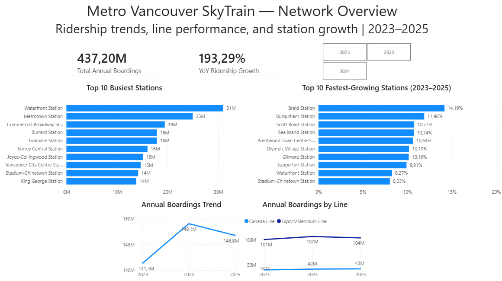
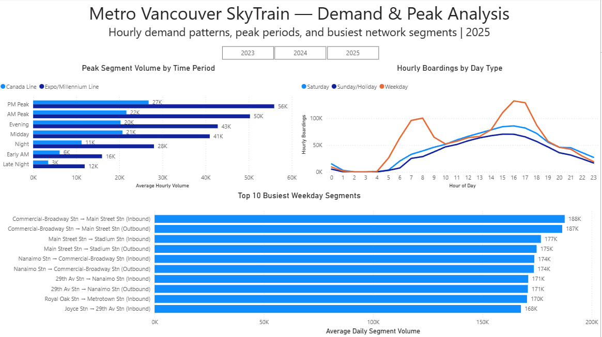
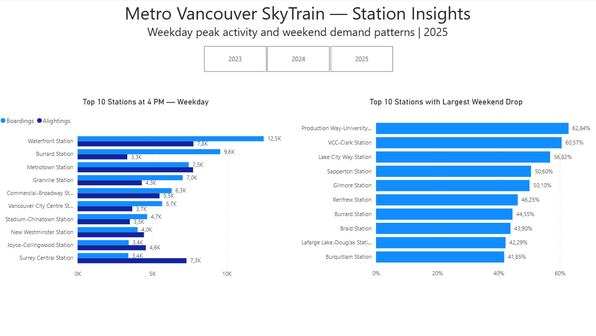

# Metro Vancouver SkyTrain Ridership & Network Demand Analysis

An end-to-end data analytics project analyzing SkyTrain ridership, station demand, peak travel patterns, and network segments across Metro Vancouver from 2023 to 2025.

The project combines Python for data cleaning and preparation, PostgreSQL and SQL for exploratory and analytical querying, and Power BI for interactive data visualization.

## Project Objectives

The analysis focuses exclusively on the SkyTrain network, including the Canada Line and Expo/Millennium Line.

The main objectives were to:

- Analyze overall SkyTrain ridership trends from 2023 to 2025
- Compare ridership patterns between SkyTrain lines
- Identify the busiest and fastest-growing stations
- Analyze hourly demand and differences between weekdays and weekends
- Identify peak travel periods across the network
- Determine the busiest SkyTrain segments
- Compare station boardings and alightings during peak periods
- Identify stations with the strongest weekday-oriented demand patterns

## Tools & Technologies

- **Python (Pandas)** — data cleaning, transformation, validation, and preparation
- **PostgreSQL** — database storage and data management
- **SQL** — exploratory analysis, aggregation, ranking, and trend analysis
- **Power BI** — interactive dashboard development and data visualization
- **DAX** — calculated measures, year-over-year comparisons, and dashboard metrics
- **GitHub** — project documentation and version control

## Data

The project uses public SkyTrain ridership and network demand data from TransLink.

Six analytical datasets were prepared and used:

- Hourly station boardings and alightings
- Annual station ridership
- Rolling hourly segment volumes
- Busiest network segments
- Daily segment activity
- Annual line ridership

The datasets cover **2023–2025** and include the **Canada Line** and **Expo/Millennium Line**.

Python was used to standardize column names, clean categorical fields, validate missing values, convert hourly time ranges into a 24-hour format, and prepare the datasets for database analysis.

## Analysis Workflow

### 1. Data Cleaning & Preparation — Python

The raw TransLink datasets were inspected and cleaned using Pandas.

Key preparation steps included:

- Standardizing column names
- Cleaning text and categorical values
- Validating missing values
- Standardizing day-type categories
- Converting hourly time ranges into numeric 24-hour values
- Validating station and line identifiers
- Exporting cleaned datasets for database analysis

### 2. Exploratory & Analytical Analysis — PostgreSQL / SQL

The cleaned datasets were imported into PostgreSQL and analyzed using SQL.

The analysis included:

- Annual network ridership trends
- Line-level ridership comparisons
- Top stations by annual boardings
- Station growth between 2023 and 2025
- Hourly weekday and weekend demand patterns
- AM and PM peak analysis
- Busiest network segments
- Directional segment demand
- Weekday versus weekend station demand
- Station boardings versus alightings during peak periods

SQL results were also used to validate the calculations displayed in Power BI.

### 3. Interactive Dashboard — Power BI

An interactive Power BI dashboard was developed with three analytical pages:

#### Network Overview
Provides a high-level view of network performance, including annual boardings, year-over-year growth, line-level trends, busiest stations, and station growth.

#### Demand & Peak Analysis
Explores hourly demand patterns, differences between weekdays and weekends, peak-period volumes, and the busiest weekday network segments.

#### Station Insights
Examines station-level travel patterns, including PM peak boardings versus alightings and stations with the largest decline in demand during weekends.

## Key Findings

- Total SkyTrain annual boardings increased from approximately **141.3 million in 2023 to 149.1 million in 2024**, before declining slightly to approximately **146.8 million in 2025**.
- This represented an approximately **1.5% year-over-year decline in 2025**.
- The **Expo/Millennium Line** accounted for the majority of network ridership and drove most of the overall decline in 2025, while the **Canada Line continued to grow**.
- **Waterfront Station** was the busiest station in 2025 with approximately **10.7 million annual boardings**, followed by Metrotown and Commercial-Broadway.
- Weekday demand showed two distinct commuter peaks, with a morning peak around **7–8 AM** and a larger afternoon peak around **4–5 PM**.
- Weekend demand followed a smoother pattern, with activity concentrated more heavily in the afternoon.
- **Production Way–University, VCC–Clark, and Lake City Way** showed some of the largest declines in demand on weekends, indicating strong weekday-oriented travel patterns.
- PM peak station activity showed substantial differences between boardings and alightings at major stations, reflecting directional commuter flows across the network.

## Dashboard

### Network Overview



### Demand & Peak Analysis



### Station Insights



## Repository Structure

```text
Metro-Vancouver-SkyTrain-Analysis/
│
├── data/
│   ├── raw/
│   └── processed/
│
├── images/
│   ├── network_overview.png
│   ├── demand_peak_analysis.png
│   └── station_insights.png
│
├── notebooks/
│   ├── 01_data_understanding.ipynb
│   └── 02_data_cleaning.ipynb
│
├── power_bi/
│   └── Metro_Vancouver_SkyTrain_Analysis.pbix
│
├── sql/
│   └── skytrain_analysis.sql
│
└── README.md
